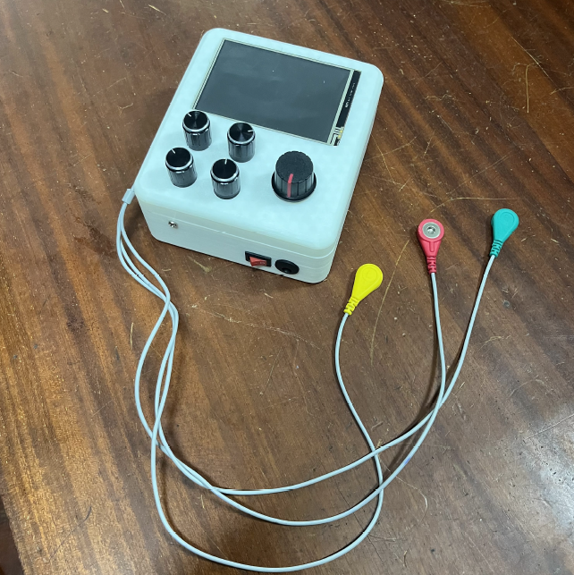

# Heart Rate Monitor

## Table of Contents
- [Introduction](#introduction)
- [Functionality](#functionality)
- [Printed Circuit Board](#printed-circuit-board)
- [Enclosure Design](#enclosure-design)
- [Contributors](#contributors)

## Introduction
An electrocardiogram (ECG) is a simple diagnosis technique employed to assess the heart’s electrical activity by detecting electrical signals generated during each heartbeat through electrodes fixed to the skin. The voltage difference between the right arm and left arm is magnified, incorporating a feedback mechanism through the right leg. ECG leads measure these voltages from the right arm, left arm, and right leg. The voltage signal’s amplitude ranges from 0.001 mV to 100 mV (typical value is 1 mV), with a frequency spanning from 0.01 Hz to 250 Hz. Amplifying this signal proves challenging due to the small amplitude of the raw ECG signals and subjection to corruption from various sources such as noise, power line interference, RF inteference, noise from electrode contact, stray capacitance, and bio signal artifacts induced by movements of the subject. In our project we propse and implement a analog circuit to amplify the above eletrical signal and to perform filtering to reduce noise. We make use of only basic analog electrical devices such as resistors, capacitors and OpAmps in our design.

The below block diagram illustrates the stages of signal conditioning employed in our design.

We implement the design of our circuit on a single PCB using the Altium PCB design software. All circuits were simulated using LTSpice and MultiSim prior to implementation.

## Functionality
Our Heart Rate Monitor offers the following features:
- Real-time heart rate measurement.
- User-friendly interface for easy operation.
- Accurate heart rate data display.
- Adjustable measurement settings to cater to various scenarios.
- Data logging and export capabilities for further analysis.
- Detailed documentation for developers and users.
  
## Printed Circuit Board
The PCB was deisgned using Altium Designer PCB Software.In our design approach, we employed 4 layersto minimize interference. This consists of two signal layers, the ground layer and the power layer. The PCB was designed in a way that the processor (ESP32 Dev Module) is also mounted on the same PCB. The PCB and display wiring is also included within the PCB routing.
After the fabrication, the relevant components are soldered by hand to the PCB. For convenience of replacement, we soldered IC bases and mounted the ICs onto them. Additionally, we used JST cables and pin headers for easy replacement.

## Enclosure Design
The SolidWorks CAD software was utilized to design the enclosure. This enclosure has a removable top lid, facilitating the fixation and replacement of components as needed. To prevent damage to the components, there are strategically placed ventilation and airflow, allowing heat to dissipate to the outside. The top lid houses the display and knobs for filter tuning. A power on/off switch is positioned on the side. The enclosure is equipped with holes for power adapter input and 3.5mm jack connections.

## Contributors
- [Sajitha Madugalle](https://github.com/Sajitha-Madugalle)
- [Devnith Wijesinghe](https://github.com/devnithw)
- [Tashin Kavishan](https://github.com/kavishanGT)
- [Charles Jhone Peter](https://github.com/Charlie174)
